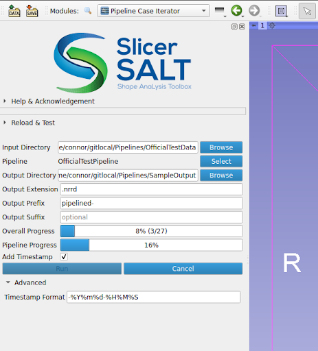

# Pipeline Case Iterator User Guide

Also included in the SlicerPipelines extension is the Pipeline Case Iterator, which will allow you to run a pipeline sequentially over a directory of files.

While the pipeline is running, Slicer can still be used, as the pipeline is run in a different process.

## Parameters

| Parameter | Description |
| :---      | :---        |
| Input Directory | The directory where the files to run over are located. |
| Pipeline | The pipeline to run over the directory. |
| Output Directory | The directory to put the output of the pipeline. |
| Output Extension | Optional extension to save output files as. If no extension is given, it will attempt to deduce a valid extension. If it is unable to do so, an error will be shown. |
| Output Prefix | An optional prefix to put on the created files. |
| Output Suffix | An optional suffix to put on the created files. |
| Add timestamp | If checked, will add a timestamp of the given format (see [Advanced Parameters](#advanced-parameters)) to each generated filename. The same timestamp will be given to all files in the same run. |

## Advanced Parameters

| Parameter | Description |
| :---      | :---        |
| Timestamp Format | Format of the timestamp. Will be passed to Python's [`datetime.date.strftime`](https://docs.python.org/3/library/datetime.html#datetime.date.strftime). |
