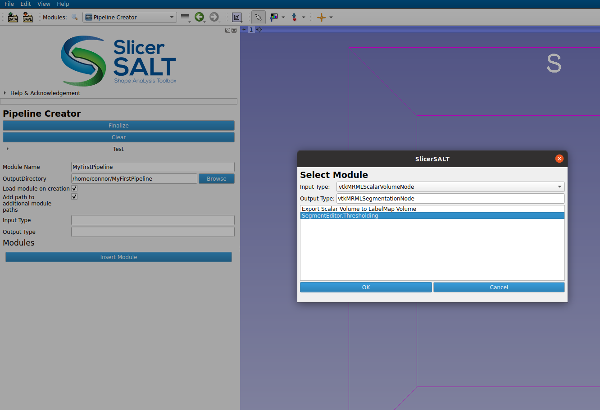
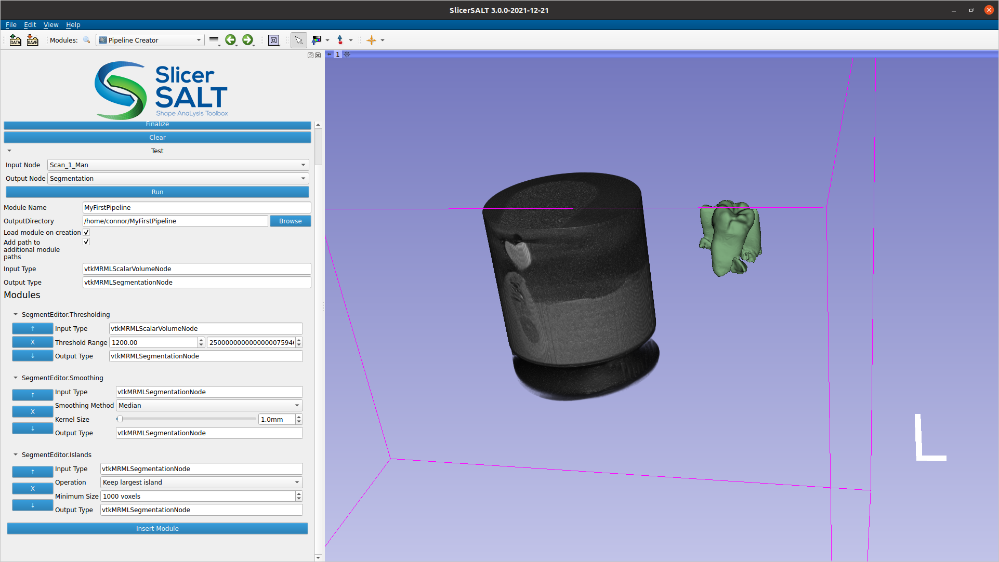

# Pipeline Creator User Guide

The Pipeline Creator allows for the creation and use of simple modules in [3D Slicer](https://www.kitware.com/open-source/#3d-slicer) without coding. This module was developed as part of [SlicerSALT](https://salt.slicer.org/) and has been added to the Slicer Extensions Index for the open source community to use.

We define a pipeline as a piece of logic that takes a single MRML node as input (a model, a volume, etc) and returns a single MRML node as output. Some examples are converting a model to a segmentation, the segment editor’s hollow, margin, and thresholding effects, and items like decimation and smoothing out of the Surface Toolbox.

Because they currently can only take a single node as input and return a single node as output, they are best for simple, repetitive workflows (e.g. threshold an image, apply smoothing, convert to a model, repeat for the next image). For more complicated workflows that depend on multiple MRML inputs, or user interaction, manually coding a new module is still the way to go.

The PipelineCreator module will greatly help reproduce repetitive image processing workflows by bundling many steps in a single pipeline. All you need is workflow and a folder to put the created module in.

## Tutorial

In 3D Slicer switch to the "Pipeline Creator" module.

To add steps to your pipeline, press the “Insert Module” button. This will show a window where you can select the item you want to add. Pick the item you want, fill in its parameters, and then select the next item in the pipeline. You need to repeat this process until the pipeline has all the steps in your workflow.



<figcaption>

Figure 1: Inserting a module into the pipeline

</figcaption>

To make sure everything will work as you want it to, there is a “Test” drop down that will let you try out the pipeline at any point in the process. Just select your input, press run, and it will give you your output.



<figcaption>

Figure 2: Testing a pipeline with multiple modules. Segmentation was manually moved to the right.

</figcaption>

Once all the steps have been appropriately captured in your pipeline interface, you can fill in the remaining fields like name and output directory, press Finalize and you will have yourself a brand new module to work with. If there are any errors during the creation of the pipeline, a pop up window will tell you what went wrong. If you had the “Load module on creation” checkbox checked, you should be able to find your new pipeline in the modules dropdown under a “Pipeline Modules” folder. You should also be able to find your new pipeline in the “Insert Module” pop up of the pipeline creator, so you can use it as a piece in a future pipeline.

If you are command line oriented, there is even a python script under <output-folder>/CommandLineScripts/ that will allow you to run the pipeline from the command line (actual name of script will depend on your pipeline name).

```
./Slicer --no-main-window --python-script=CommandLineScripts/RunMyPipeline.py <input-file> <output-file>
```

:::{note}

The created module is not published to the extension index, but since it is all Python you can share with others by putting the folder in a zip file, sending to them, and then they need to add the unzipped folder to Edit -> Application Settings -> Modules -> Additional module paths.

:::
